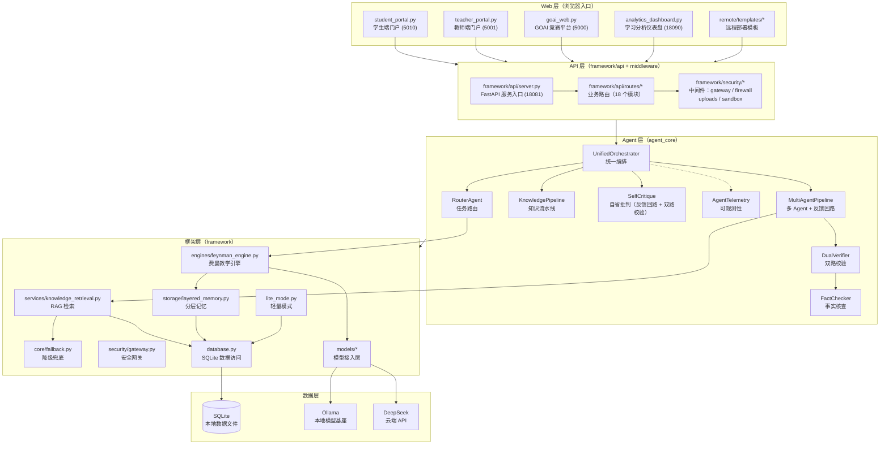

# LumiLearn 架构文档

> 版本：1.0 · 适用代码基线：2026-08 · 用途：项目整体架构说明（分层、模块接口、自研/第三方边界、安全与隐私）

---

## 1. 架构总览

LumiLearn 是一个**本地优先、多 Agent 协同的 AI 辅助学习平台**，整体采用分层架构：Web 层 → API 层 → Agent 层 → 框架层 → 数据层，自顶向下单向依赖，各层通过统一接口解耦。

### 1.1 分层架构图

### 1.2 分层说明

| 层级 | 构成 | 职责 |
| --- | --- | --- |
| **Web 层** | `student_portal.py`、`teacher_portal.py`、`goai_web.py`、`analytics_dashboard.py` + `remote/templates/*` | 面向学生、教师、管理员、竞赛评审的浏览器端入口；远程部署时通过模板页面（admin / teacher / goai_dashboard / analytics_dashboard 等）提供服务 |
| **API 层** | `framework/api/server.py`（FastAPI）、`framework/api/routes/*`（18 个业务路由）、`framework/security/*` 中间件 | 统一 HTTP 网关：认证鉴权、参数校验、限流、CORS、上传安全、沙箱隔离，将前端请求转化为 Agent 层调用 |
| **Agent 层** | `agent_core/*`：统一编排、路由、知识流水线、多 Agent、双路校验、事实核查、可观测性、自省批判 | 核心智能调度：按任务复杂度路由到不同 Agent 组合，执行教学生成、校验、修正的完整回路 |
| **框架层** | `framework/*`：费曼引擎、RAG 检索、降级兜底、分层记忆、安全网关、数据库访问、轻量模式、模型接入 | 平台能力底座：为 Agent 层提供可复用的教学引擎、检索、存储、安全、容错基础设施 |
| **数据层** | SQLite 数据文件 + 模型基座（Ollama 本地 / DeepSeek 云端） | 全部业务数据本地落盘；大模型仅作为推理后端被调用（详见第 3 节） |

---

## 2. 模块接口说明表

> 说明：表中"关键接口"均取自当前代码基线中的真实类/函数签名。个别能力（自省批判、双路校验、同义词典）在项目中以函数/既有组件形式实现，未单设同名类，已在"职责"栏如实注明对应实现载体。

| 模块名 | 路径 | 职责 | 关键接口 |
| --- | --- | --- | --- |
| **UnifiedOrchestrator** | `agent_core/orchestrator.py` | 统一编排入口：整合 Router + LangGraph 引擎 + 多 Agent 系统，按 `simple / standard / complex_parallel` 路由分发，集成双路校验与人工中断 | `run(payload)` / `interrupt(reason, node)` / `resume(decision)` / `get_status()` |
| **RouterAgent** | `agent_core/router.py` | 任务路由：解析用户输入，判定复杂度与学科，选择单模型 / 多 Agent 并行 / 多模型并行，支持调用预算控制 | `route(user_input, context)` / `route_with_budget(user_input, context)` |
| **KnowledgePipeline** | `agent_core/knowledge_pipeline.py` | 知识流水线：文档解析 → 知识点抽取 → 去重 → 冲突检测 → 入库 | `parse_document(text, subject)` / `extract_knowledge_points(chapter)` / `deduplicate(points)` / `detect_conflicts(points)` / `save_to_db(points)` |
| **MultiAgentPipeline** | `agent_core/multi_agent.py` | 多 Agent 并行编排：费曼教学、评分、辅导多角色 Agent 协同，内含生成—批判—修正反馈回路 | `run(payload)`；角色 Agent：`FeynmanTeacher.run()` / `ScoreAgent.run()` / `CoachAgent.run()` |
| **SelfCritique（自省批判）** | `agent_core/multi_agent.py` + `agent_core/verifier.py` | 自我批判机制：通过多 Agent 反馈回路 + `dual_verify` 双路校验对生成内容进行独立复核与修正（未单设同名类，由上述两组件共同承担） | 反馈回路（MultiAgentPipeline 内部）+ `dual_verify(content, prompt)` |
| **DualVerifier（双路校验）** | `agent_core/verifier.py` | 校验 Agent：结构校验（`FactChecker.verify_question`）+ 独立模型复核双重验证，fail-open 兜底（模型异常时放行不崩溃） | `dual_verify(content, prompt)` / `verify_teaching(payload)` / `_parse_dual_verify_verdict(raw)` |
| **FactChecker（FactCheckerAgent）** | `agent_core/fact_checker.py` | 事实核查：题目/知识点规范校验与内容核查 | `run(payload)` / `verify_question(question)`（静态方法） |
| **AgentTelemetry** | `agent_core/observability.py` | 可观测性：全链路追踪、调用指标采集、审计日志、人工中断请求（EU AI Act Article 14 human-in-the-loop） | `start_trace()` / `record_call(...)` / `end_trace()` / `audit_log(level, message)` / `request_interrupt(tid, reason, node)` |
| **SafetyGuard** | `agent_core/safety.py` | 调用前安全控制：频率限制、预算检查、模型白名单 | `check_call(...)` |
| **PromptGuard** | `agent_core/prompt_guard.py` | 提示注入防护：输入结构校验 + 注入检测 | `sanitize_payload(payload)` |
| **KnowledgeRetriever** | `framework/services/knowledge_retrieval.py` | RAG 检索：基于 training_data + knowledge_nodes 构建倒排索引，TF-IDF 打分检索，附上下文格式化 | `search(query, top_k)` / `build_index(force)` / `refresh()` / `status()`；`format_rag_context(results, max_chars)` |
| **FeynmanEngine** | `framework/engines/feynman_engine.py` | 费曼教学法引擎：按学习阶段（L1–L5）分层讲解、分步拆解、流式输出 | `explain(topic, level)` / `explain_step(topic, level)` / `explain_stream(topic, level)` |
| **LayeredMemory** | `framework/storage/layered_memory.py` | 分层记忆系统：短期（会话）/ 中期（章节）/ 长期（主题）三级记忆存取 | `save_short_term(user_id, session_id, content)` / `save_mid_term(user_id, chapter, content)` / `save_long_term(user_id, content, topic)` / `get_active_memories(user_id)` / `get_long_term_memories(user_id)` / `get_memory_stats(user_id)` |
| **FallbackHandler** | `framework/core/fallback.py` | 降级兜底：JSON 容错解析、多级重试、友好错误信息 | `run_with_fallback(fn, ...)` / `safe_json_parse(raw, retries)` / `friendly_message(error_type)` |
| **DatabaseManager** | `framework/database.py` | SQLite 数据访问层：全库统一入口（业务数据、训练数据、知识点、会话等），提供 `db` 单例 | `db` 单例；`get_training_data(...)` / `query(...)` / `execute(...)` 等 CRUD |
| **LiteModeManager** | `framework/lite_mode.py` | 轻量自学模式：低资源环境裁剪服务、切换端口与功能集合 | `is_lite()` / `get_enabled_services(port_settings)` |
| **领域词典 / 同义扩展（DOMAIN_TERMS）** | `framework/services/knowledge_retrieval.py` | 检索用轻量中文分词：领域词典精确匹配 + 停用词过滤 + 2-gram 补充（承担同义/领域词扩展能力，未单设 `synonym_dict` 同名模块） | `tokenize(text, max_terms)` |
| **SecurityGateway** | `framework/security/gateway.py` | 安全网关中间件：认证鉴权、请求过滤、CORS、安全响应头；配套 `firewall.py` / `uploads.py` / `sandbox.py` | 中间件入口 / 各安全策略模块 |
| **ApiServer** | `framework/api/server.py` | FastAPI 服务入口：路由注册、中间件装配、启动配置（端口 18081） | 应用工厂 + `/api/*` 路由挂载 |
| **模型接入层** | `framework/models/*` | 多 provider 模型调用：Ollama 本地、OpenAI 兼容容器、云端 API 统一抽象 | `ollama_provider.py`（Ollama 调用）/ `registry.py`（模型注册）/ `base.py`（统一接口） |

---

## 3. 自研模块 / 第三方依赖区分表

### 3.1 自研模块（本仓库自主开发）

| 类别 | 模块 / 路径 | 说明 |
| --- | --- | --- |
| Agent 编排 | `agent_core/orchestrator.py`、`agent_core/router.py`、`agent_core/multi_agent.py`、`agent_core/langgraph_engine.py` | 统一编排、任务路由、多 Agent 并行与反馈回路 |
| 知识流水线 | `agent_core/knowledge_pipeline.py`、`framework/pipeline/knowledge_parser.py` | 知识点抽取、去重、冲突检测、入库 |
| 费曼教学引擎 | `framework/engines/feynman_engine.py`、`framework/engines/feynman_templates.py` | 分阶段讲解、分步拆解、流式输出 |
| RAG 检索 | `framework/services/knowledge_retrieval.py` | 倒排索引 + TF-IDF 检索 + 上下文格式化 |
| 记忆系统 | `framework/storage/layered_memory.py`、`framework/storage/file_compat.py` | 三层记忆存取、文件兼容层 |
| 评测体系 | `agent_core/verifier.py`、`agent_core/fact_checker.py`、`framework/output_detector.py`、`tests/*` | 双路校验、事实核查、学习产出检测与全量测试套件 |
| Web 平台 | `student_portal.py`、`teacher_portal.py`、`goai_web.py`、`analytics_dashboard.py`、`framework/api/*`、`remote/templates/*` | 多端门户、API 服务、远程部署模板 |
| 安全体系 | `framework/security/*`、`agent_core/safety.py`、`agent_core/prompt_guard.py` | 安全网关、防火墙、沙箱、上传安全、调用检查、注入防护 |
| 运维与扩展 | `framework/lite_mode.py`、`framework/workflow_engine.py`、`framework/log_retention.py`、`data_management/*`、`deploy/*`、`scripts/*` | 轻量模式、流程引擎、日志留存、数据管理、部署脚本 |
| 模型训练/推理代码 | `framework/model.py`、`framework/tokenizer.py`、`framework/trainer.py`、`inference.py`、`inference_server.py` | 自研训练/推理管线（含自研 BPE tokenizer） |

### 3.2 第三方依赖基座（推理后端 / 运行时组件）

| 类别 | 依赖 | 用途 |
| --- | --- | --- |
| 模型基座 | Qwen2.5（如 `qwen2.5:7b`）、DeepSeek（`deepseek-chat` / `deepseek-reasoner` API） | 教学讲解、评分、校验的底层大模型 |
| 本地推理运行时 | Ollama（`OLLAMA_BASE_URL` 连接，默认模型 `lumilearn-v2:latest`）；可选 OpenAI 兼容容器（vLLM / LM Studio / LocalAI） | 模型加载与推理服务 |
| OCR | PaddleOCR / PaddlePaddle | 手写与图片识别 |
| 语音 | OpenAI Whisper | 语音转写 |
| 动画 | Manim / Manimlib | 数学动画渲染 |
| Web/框架 | FastAPI、Flask、Uvicorn、Jinja2 | Web 服务与模板渲染 |
| 机器学习库 | torch、transformers、datasets、accelerate、peft | 训练与推理底层库 |
| 其他 | numpy、pandas、matplotlib、seaborn、scikit-learn、requests、python-dotenv、pyyaml、pytest、genanki 等 | 数据处理、可视化、配置、测试、记忆卡片 |

### 3.3 披露说明

> **基座模型仅作为推理后端被调用，不参与本项目训练。**
> 本项目的核心价值（教学编排、知识流水线、检索、记忆、评测、多端平台）均为自研代码；Qwen2.5、DeepSeek 等第三方模型仅通过 Ollama 本地运行时或云端 API 以推理方式提供服务，其权重与训练过程不归属本项目（仓库另有可选 LoRA 微调实验脚本，默认不启用，不影响上述披露结论）。

---

## 4. 安全与隐私声明

### 4.1 数据本地存储

- 所有业务数据（用户、会话、知识点、训练数据、分层记忆等）默认存储在**本地 SQLite** 数据库中，由 `framework/database.py` 统一访问，不依赖外部数据库服务。
- 会话记忆（`layered_memory.py`、`conversation_store.py`）同样本地持久化，用户数据默认不出本机。

### 4.2 密钥走环境变量

- 所有密钥与敏感配置（Web 入口 session 密钥、管理员初始密码、云端模型 API Key、远程主机连接信息等）一律通过**环境变量**注入（见 `.env.example`），仓库中不保存真实凭证。
- 生产环境（`LUMILEARN_ENV=production`）启用 **fail-closed** 策略：缺失必要密钥将拒绝启动。
- 部署文档与脚本仅引用环境变量占位符，不包含任何真实主机地址、密码或 API Key。

### 4.3 AI 辅助工具边界

- **人工介入机制**：编排器内置人工中断/恢复流程（`interrupt` / `resume`），在敏感主题检测、内容校验未通过等场景请求人工审核（human-in-the-loop，参照 EU AI Act Article 14）。
- **输入防护**：`prompt_guard` 对用户输入做结构校验与提示注入检测，`safety.py` 在模型调用前执行频率/预算/白名单检查。
- **输出校验**：生成内容经双路校验（结构校验 + 独立模型复核）与事实核查后才对外呈现，低置信度内容自动标记或转人工。
- **边界声明**：本项目 AI 能力定位为**学习辅助工具**，最终教学判断与学习决策以学生、教师本人为准；相关内容与合规细节详见 `docs/AI-ASSISTANCE.md` 与 `docs/privacy_compliance.md`。
