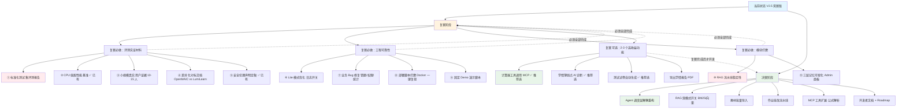

# LumiLearn 复赛→决赛迭代路线图

> **适用赛道**：GOAI 无界应用（AI+教育）、全国青少年人工智能创新挑战赛
> **核心原则**：复赛补证据 + 强化已有闭环，少新增大功能；决赛再开发高阶能力



## 阶段里程碑

```
V2.5 竞赛版（当前）
    │
    ├─► 复赛准备期（2-4 周）
    │     ├─ 必做：①③④⑥⑦⑧⑨（文档 + 工程）
    │     ├─ 必做：②⑩⑪（已有 + 优化）
    │     └─ 可选：选 2-3 个（计算器/学情诊断/试卷生成）
    │
    ├─► 复赛答辩
    │     └─ 演示闭环链路 + Trace 日志 + 模型对比
    │
    └─► 决赛冲刺期（复赛通过后）
          ├─ Agent 调度解耦
          ├─ RAG 双模式
          ├─ 教材批量导入
          └─ 开源生态完善
```

## 答辩演示脚本（完整版）

```
时长：8-10 分钟

[0:00-0:30] 开场：一句话定位
  "LumiLearn 是一款在普通 CPU 上即可运行的 K12 理科 AI 学习系统，
   让没有 GPU 的学校也能用上 AI 教学。"

[0:30-2:00] 完整闭环演示
  Step 1: Admin 导入教材（展示文档解析）
  Step 2: 学生端选择"勾股定理"，FeynmanTeacher 五步教学
  Step 3: AI 出题 → 学生答题 → ScoreAgent 批改
  Step 4: 错题入库 → 学情仪表盘显示薄弱点

[2:00-3:00] Trace 可视化
  "这不是简单 Prompt 套壳，每步都有多 Agent 协作。"
  打开 /admin/traces 展示完整调用链

[3:00-4:00] 模型对比
  同时演示 8M 自研模型 vs Qwen-7B，说明算力平权设计

[4:00-5:00] 评测数据
  出示：标准化测试集表格、CPU 性能基准、用户试用报告摘要

[5:00-6:00] 风险声明
  "AI 幻觉风险如实披露，不能替代教师，详见 RISK-STATEMENT.md"

[6:00-7:00] 差异化定位
  "OpenMAIC 做虚拟课堂多人互动，我们做课后自学 + 学情管理，
   解决不同教育痛点。"

[7:00-end] Q&A 准备
  重点准备：性能瓶颈、幻觉控制、真实用户证据
```

## 风险红线

| ❌ 禁止 | 原因 |
|---|---|
| 大规模重构 Agent 内核 | 破坏已跑通闭环 |
| 堆砌白板/TTS/数字人 | 冲淡核心定位 |
| 同时开发全部可选功能 | 战线过长 |
| 口头夸大模型效果 | 如实披露 |
